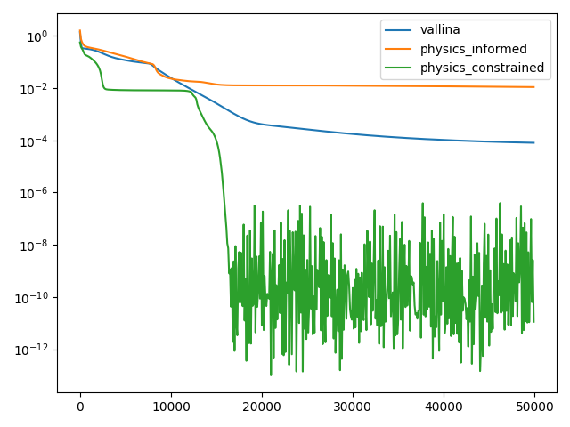
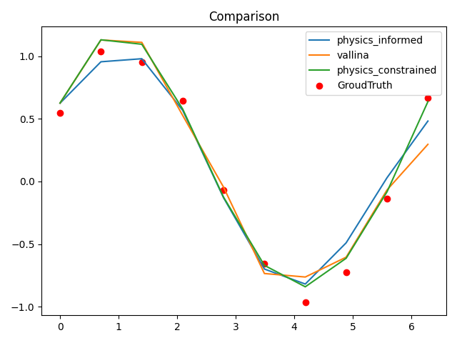
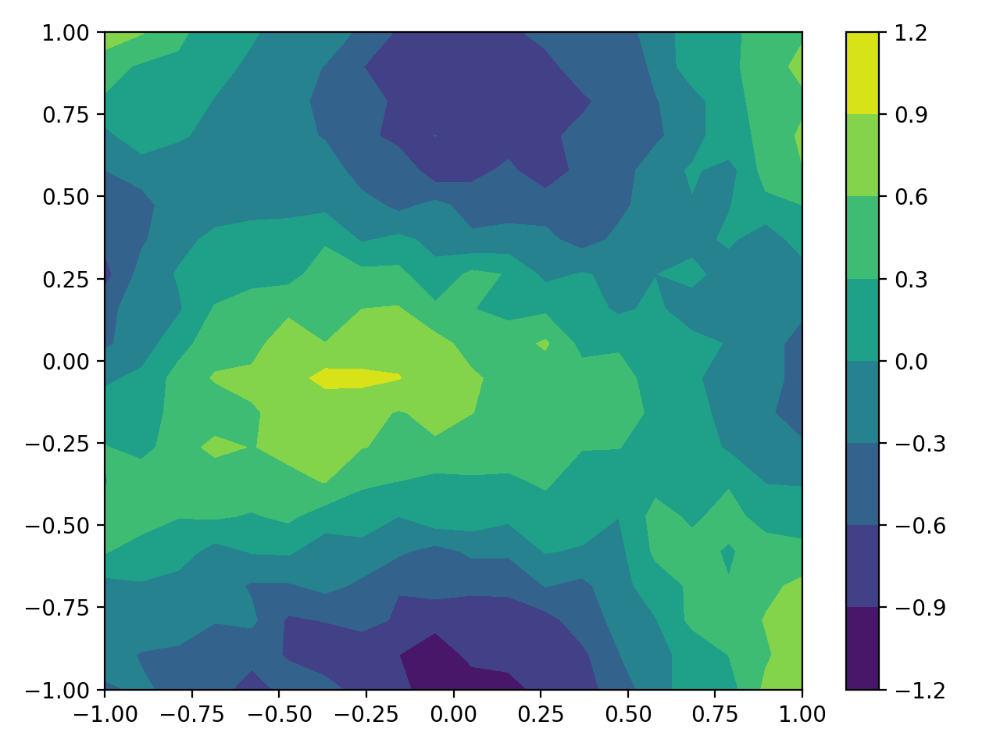
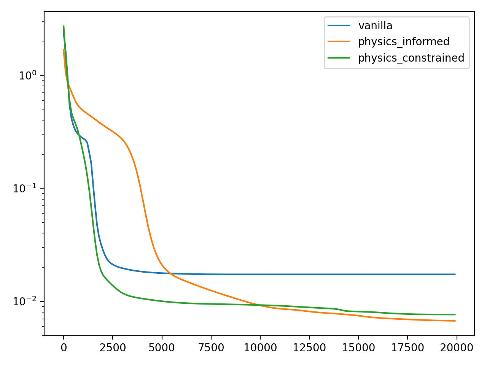
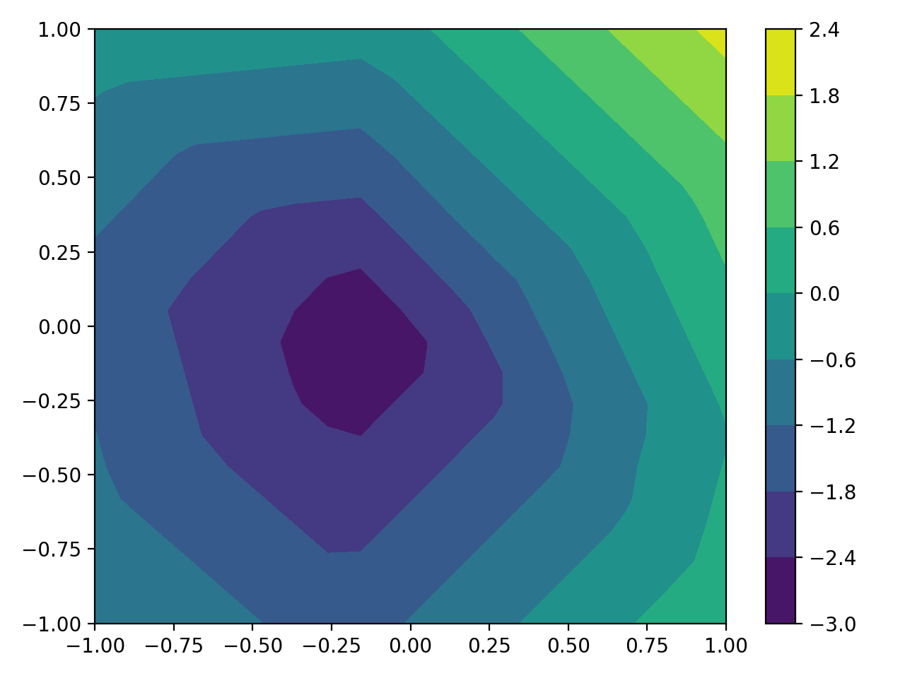
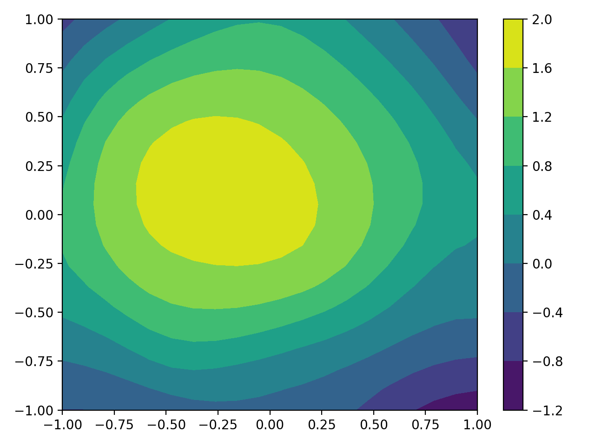
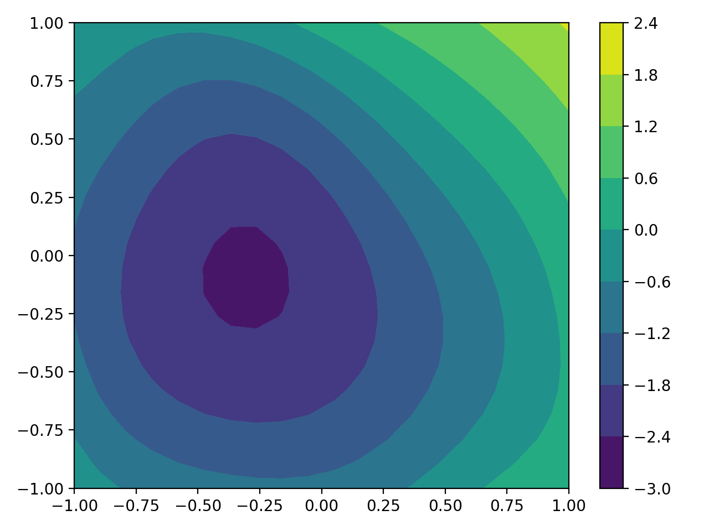
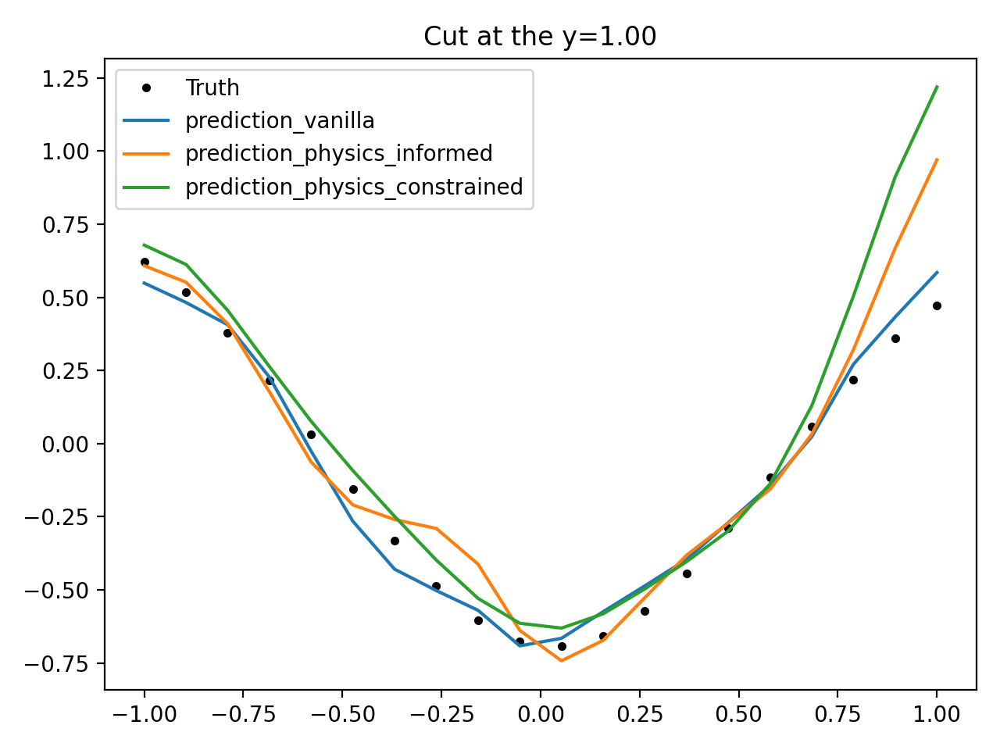
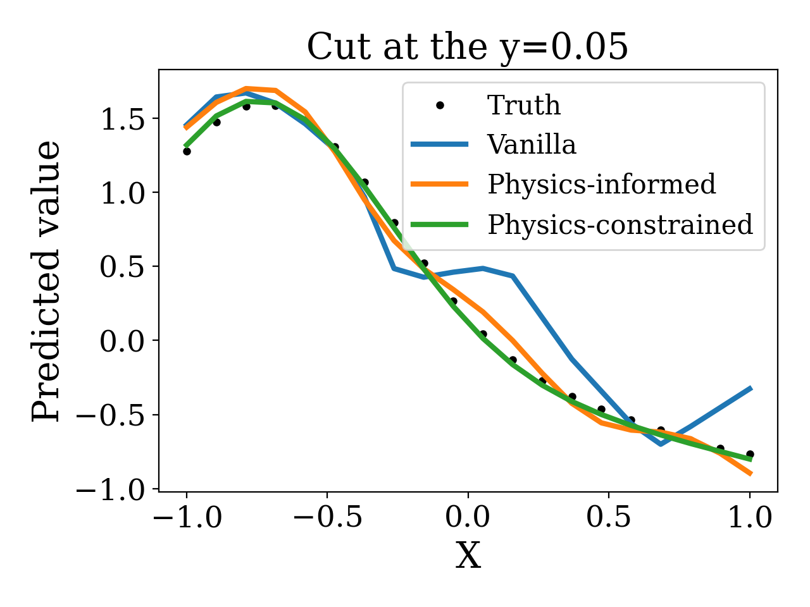
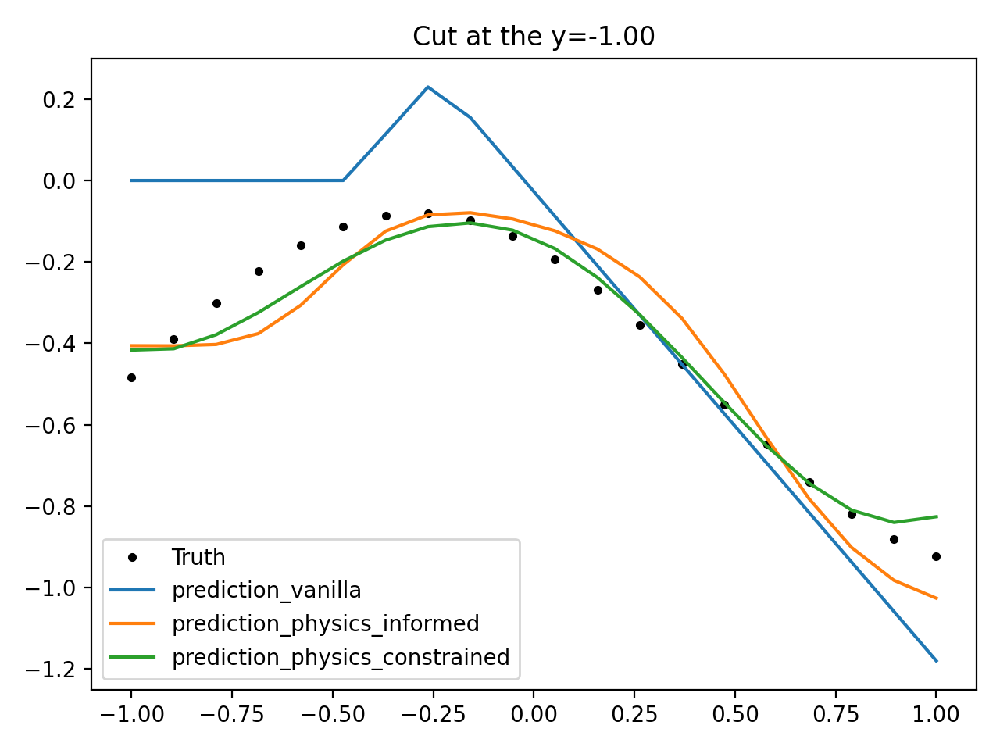

# gaussian_nn_tugraz
This is a repository of some researches about the link between Gaussian Process and the NN.

We referred to the [work](https://arxiv.org/abs/2209.12737).

- We compared the performance of Vanilla, PINN and physics-constrained network in this work (PCNN).
- There is no doubt that the PCNN performs best as the activation function is constrained like the physics kernel 
in the Gaussian Process mentioned in [this work](https://arxiv.org/pdf/1905.07907.pdf).

# 1-D Helmholtz equations
- The noise is in random normal distribution with a scale of 0.10.

- From the results, we can see that, with 
    - with a proper activation function or physics (informed or constrained), like the PCNN, the model perform
better against the noises.
    - in **vanilla** network, the activation is **ReLU()**, 
  in **PINN** the activation is **Sigmoid()**, while in the
  **PCNN** work the activation is **sin()**
    - with a constrained proper activation function, the PCNN performs the best.
    - compared with the results of 'vanilla' network, the PINN and PCNN behave better against the noise.

    

    <em>training loss (1D)</em>

**training loss (1D)**

**prediction (1D)**

# 2-D Helmholtz equations
First, the training datasets is generated via Random Gaussian process, whose kernel is 
), and **noise=0.1**.

Only 0.2 of the training datasets with noises are fed into the training process.

All of the networks are consists of 2 forword layer, with **vanilla ReLU()** activation, **PINN Sigmoid()** activation 
and **PCNN 
sin()** activation.

**Training datasets with noise (2-D)**

**Training datasets without noise (2-D)**

**Training loss**

**vanilla prediction (2-D)**

**physics_informed prediction (2-D)**

**physics_constrained prediction (2-D)**

**Cut to see the prediction (at the *top*)**

**Cut to see the prediction (at the *medium*)**

**Cut to see the prediction (at the *bottom*)**

