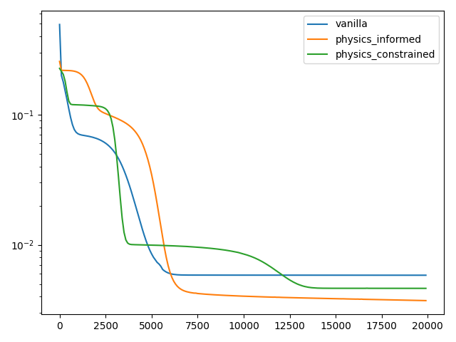
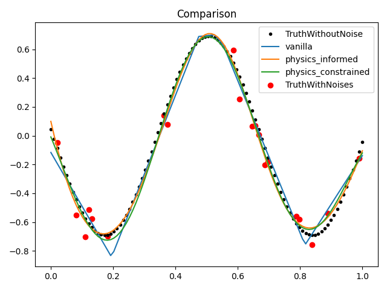

# gaussian_nn_tugraz
This is a repository of some researches about the link between Gaussian Process and the NN.

We referred to the [work](https://arxiv.org/abs/2209.12737).

- We compared the performance of Vanilla, PINN and physics-constrained network in this work (PCNN).
- There is no doubt that the PCNN performs best as the activation function is constrained like the physics kernel 
in the Gaussian Process mentioned in [this work](https://arxiv.org/pdf/1905.07907.pdf).

# 1-D Helmholtz equations
- The noise is in random normal distribution with a scale of 0.10.

- From the results, we can see that, with 
    - with a proper activation function or physics (informed or constrained), like the PCNN, the model perform
better against the noises.
    - in **vanilla** network, the activation is **ReLU()**, 
  in **PINN** the activation is **Sigmoid()**, while in the
  **PCNN** work the activation is **sin()**
    - with a constrained proper activation function, the PCNN performs the best.
    - compared with the results of 'vanilla' network, the PINN and PCNN behave better against the noise.
    
|  |  |
|:--:| :--:| 
| **training loss (1D)** |**prediction (1D)**|

# 2-D Helmholtz equations
First, the training datasets is generated via Random Gaussian Process, whose kernel is the [Bessel function](https://en.wikipedia.org/wiki/Bessel_function)
), and **noise=0.1**.

Only 0.2 of the training datasets with noises are fed into the training process.

All of the networks are consists of 2 forword layer, with **vanilla ReLU()** activation, **PINN Sigmoid()** activation 
and **PCNN 
sin()** activation, respectively.

## Problem during training the PINN
We found the optimization concentrated too much on the optimization of the physics term 

    
|  |  |
|:--:| :--:| 
| **Training datasets with noise (2-D)** |**Training datasets without noise (2-D)**|
|  |  |
| **Training loss (2-D)** |**Vanilla prediction (2-D)**|
|  |  |
| **physics_informed prediction (2-D)** |**physics_constrained prediction (2-D)**|

|  |  | |
|:--:| :--:| :--:| 
| **Cut to see the prediction (at the *top*)** |**Cut to see the prediction (at the *medium*)**|**Cut to see the prediction (at the *bottom*)**|

# Discussion
- First, only the proper activation according to the datasets can help the model regression well. For example, the
vanilla network with **ReLU()** performs poor.
- with proper the activation, the PCNN can perform as well as the PINN. 
- The PINN training is very time-consuming as the `grad` opertation in PINN trainig is fair complex. 
So it should be a better idea to apply the physics to the activation function.
- The PINN and the PCNN both can help the model generalize better and resist the noise in the training datasets as the 
physics conditions are included.

